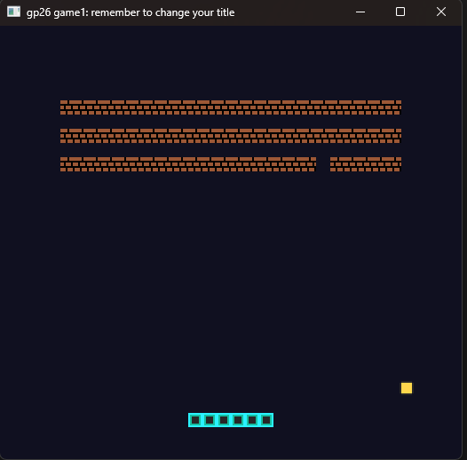
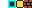

# Shrinking Breakout

Author: Jiawei Li || Lee

Design: A Breakout-style game where the paddle becomes shorter as the player destroys more bricks. 

Screen Shot:

How Your Asset Pipeline Works:

The source artwork for the game is stored in sprites/sprites.png. It contains four 8x8 tiles for the empty tile, paddle, ball, and brick. 
The asset pipeline uses `asset_converter.cpp` to load `sprites.png` with `load_png`. The converter reads the RGBA pixel data and converts each 8x8 image tile into the two bitplanes. At the same time set the corresponding palettes. 
The converter writes the processed runtime data to `generated/assets.hpp`. This generated header contains the tile and palette data used by the game. 
`PlayMode.cpp` loads these generated tiles and palettes into `ppu.tile_table` and `ppu.palette_table`. 
The bricks are placed in the PPU background tilemap, while the paddle and ball are rendered using PPU sprites.

The asset pipeline flow is like:
`sprites.png` -> `asset_converter.cpp` -> `generated/assets.hpp` -> `PlayMode.cpp` -> `PPU466`

How To Play:

1.Use the Left and Right Arrow keys to move the paddle.
2.Keep the ball from falling below the bottom of the screen and use the paddle to bounce the ball into the bricks. Destroy all of the bricks to win.
3.After winning or losing, press R to restart the game.

This game was built with [NEST](NEST.md).

